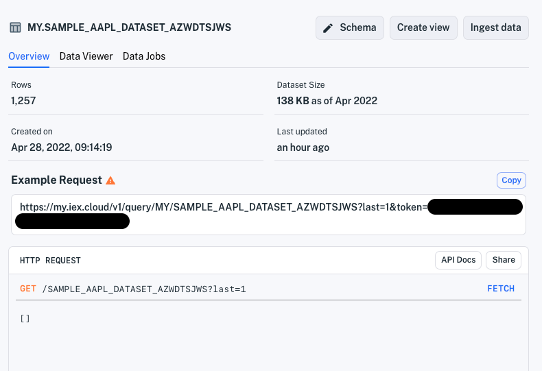

# Delivering Data to Apps

```{admonition} Early Access
Apperate is available exclusively to select Early Access program participants. If you’d like to participate in the Early Access phase or upcoming Beta, please contact `product@iexcloud.io`.
```

We're excited to show you how to make data accessible to your apps in minutes. Here you'll load sample data into Apperate and read the data from an auto-generated API.

## Loading Data

Load data into Apperate following these steps:

1. If you're not already in the dataset creation page, go to the console at <https://iexcloud.io/console>. The Apperate home page appears.

    
    
    Click **Create a dataset** to start creating a dataset. The dataset creation page appears with options for choosing a data source. In the bottom right, there is a button labeled **Use IEX Cloud's sample file**.

    

1. Load the sample data file by clicking **Use IEX Cloud's sample file**. Apperate loads the data into a new dataset and the dataset's overview page appears.

    

    **Milestone alert!** In just **two clicks**, you
    loaded time-series data into new Apperate database tables and automatically generated REST API endpoints to the data! Let's access the data next.

## Reading Data

Now that the data is in Apperate, it is accessible via a REST API. Here's how to read that data.

In your dataset overview, get your dataset's last record by clicking the **Example Request** URL. The URL opens in a new browser tab and the dataset data response (in JSON) appears.


The URL specifies the dataset REST endpoint, a query parameter to retrieve the last record, and a token authorized to execute the endpoint.

You can call the REST endpoint using a standard HTTP request. You can authorize endpoint access via a token. [Using Tokens to Access APIs](https://iexcloud.zendesk.com/hc/en-us/articles/6299201352723-Using-Tokens-to-Access-APIs) demonstrates creating access tokens.

## Endpoint API docs

Your REST API endpoint is documented too. You can access your API docs by clicking **Open API Docs** in your dataset's overview page. Your API docs open in a new tab.


You can describe your dataset properties via the schema editor--click **Edit schema** on the Overview page to access the editor. 

Congratulations on loading data into Apperate and accessing that data via the auto-generated REST API! It's just that easy to deliver data to apps!

## What's Next

It's also easy to add individual data rows (e.g., from an app) to Apperate and retrieving them. If you want to learn how, continue on with [Writing and Fetching a Record](./writing-and-fetching-a-record.md).

Another options is to start importing your own data (in CSV, JSON, or JSONL format) from one of the following sources.

- [AWS S3 bucket](../migrating-and-importing-data/loading-data-from-aws-s3.md)
- [URL](../migrating-and-importing-data/loading-data-from-a-url.md)
- [file](../migrating-and-importing-data/loading-data-from-a-file.md)

Do you want to learn more about defining datasets? Read [Understanding Dataset Schemas](../managing-your-data/defining-schemas/data-model-concepts.md).

Ready to get more teammates involved? [Add them to your team](../administration/managing-users.md).