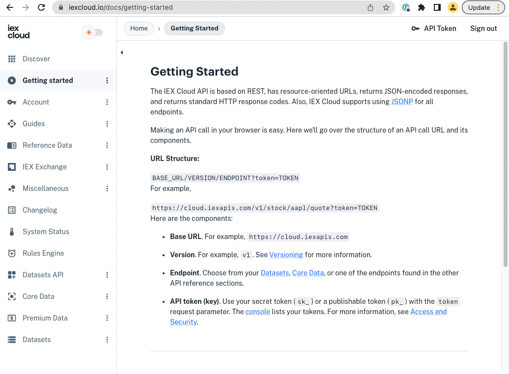

# Using Apperate's APIs

Apperate's APIs are based on [REST](https://en.wikipedia.org/wiki/Representational_state_transfer), have resource-oriented URLs, and return JSON-encoded responses and standard HTTP response codes. 

The [Apperate API Reference](https://iexcloud.io/docs/) (<https://iexcloud.io/docs/>) site provides the reference documentation and a Getting Started guide. 

Here's a screenshot of the [Getting Started](https://iexcloud.io/docs/getting-started) guide and the API Reference navigation:



The [Getting Started](https://iexcloud.io/docs/getting-started) guide is the best place to start learning the API fundamentals.

The tutorials here in this site compliment the Getting Started guide and API Reference by demonstrating how to complete different tasks using the APIs.

Here are some of the task areas and links to related tutorials and API Reference pages.

## Querying Data

The Data API's [`GET /data`](https://iexcloud.io/docs/apperate-apis/query-data) endpoint returns data from the dataset you specify. The endpoint supports using windowing functions for Querying Datasets. The [Datasets](https://iexcloud.io/docs/datasets) pages and [Core Data](https://iexcloud.io/docs/core) pages describe each dataset's `GET /data` endpoint parameters and response attributes.

``` {important} Apperate includes only historical time series Core Data at this time. We are in the process of migrating real-time legacy data, including stock quotes, into Apperate. In the meantime, please see the [Legacy API Reference](https://iexcloud.io/docs/api/) for the real-time legacy data.
```

The **Example Request** on each dataset's **Overview** page demonstrates using the `GET /data` endpoint on that dataset.


[Querying Datasets](./querying-data/querying-datasets.md) demonstrates applying windowing functions to the queries.

The API Reference's [IEX Exchange](https://iexcloud.io/docs/iex-exchange), and [Miscellaneous](https://iexcloud.io/docs/miscellaneous), and [Reference Data](https://iexcloud.io/docs/reference-data) pages describe getting Core Data that is not time series. 

## Other Data Operations

Data API instructions for the create, update, and delete operations accompany this article's CRUD-related sibling articles.

## Operations for Data-Related Entities

API instructions for managing datasets, sources, schedules, credentials, logs, and more are being applied to articles that demonstrate managing them in the console. It's a work in progress.

## Getting an API OAS Document

The [`/platform/swagger-json` endpoint](https://iexcloud.io/docs/apperate-apis/get-openapi-json) returns a JSON file that specifies the [Apperate APIs](https://iexcloud.io/docs/apperate-apis) per the OpenAPI Specification (OAS). You can generate a client SDK for your favorite language using the JSON file. 

## What's Next

As mentioned above, a great way to learn the APIs is by following the API Reference's [Getting Started](https://iexcloud.io/docs/getting-started) guide and digesting the short articles that follow it. Then work with the data and data-related entities as demonstrated in the articles mentioned above.