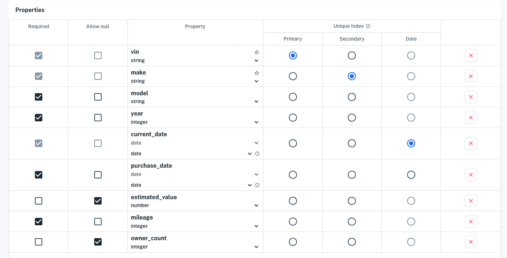
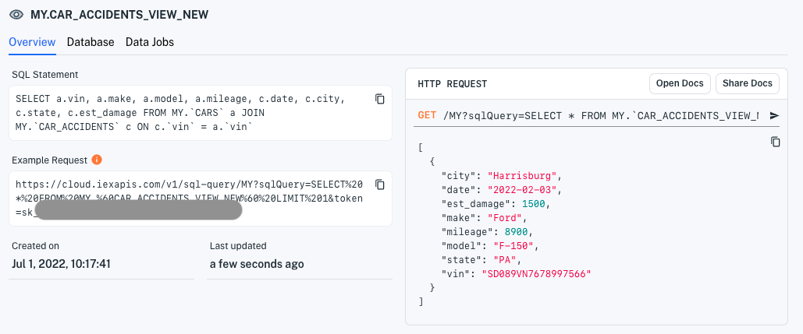

# Creating and Managing Views

```{toctree}
:maxdepth: 1

creating-and-managing-views/joining-on-core-data.md
```

Views enable you to aggregate data from various datasets, transform the data, and share the resulting data with applications. A *view* is a virtual dataset created by joining multiple datasets. The data aggregation and transformation enable you to enrich data for applications.

Here we'll create a view of cars and related car accidents by joining a datasets containing each type of data.

> **Note:** You can apply these principles to combine data from any datasets that can be joined on equivalent indexed properties.

## Create example data files

1. Create a plain text data file called `cars` on your local machine from the following example car data (it's in CSV format).

    > **Note:** The product supports CSV files that use the following common data delimiters: comma (`,`), tab, or pipe (`|`) characters. JSON and JSONL files are also supported.

    **Data**

    ```
    vin,make,model,year,current_date,purchase_date,estimated_value,mileage,owner_count
    XV859643N98D98E7C,Chevrolet,Camaro,2020,2020-03-27,2020-03-13,45955.00,32000,2
    SD089VN7678997566,Ford,F-150,2022,2020-03-27,2022-01-11,38650.00,8900,1
    59ADFG60929087DAH,Toyota,Prius,2018,2020-03-27,2019-09-23,22876.00,76000,1
    ```

    **Example Command**
    
    These commands create the data file on Linux, MacOS, and Windows.

    Linux/MacOS

    ```bash
    echo "vin,make,model,year,current_date,purchase_date,estimated_value,mileage,owner_count
    XV859643N98D98E7C,Chevrolet,Camaro,2020,2020-03-27,2020-03-13,45955.00,32000,2
    SD089VN7678997566,Ford,F-150,2022,2020-03-27,2022-01-11,38650.00,8900,1
    59ADFG60929087DAH,Toyota,Prius,2018,2020-03-27,2019-09-23,22876.00,76000,1" \
    >>CARS
    ```

    Windows

    ```
    (
    echo vin,make,model,year,current_date,purchase_date,estimated_value,mileage,owner_count
    echo XV859643N98D98E7C,Chevrolet,Camaro,2020-03-27,2020,2020-03-13,45955.00,32000,2
    echo SD089VN7678997566,Ford,F-150,2022,2020-03-27,2022-01-11,38650.00,8900,1
    echo 59ADFG60929087DAH,Toyota,Prius,2018,2020-03-27,2019-09-23,22876.00,76000,1
    )>CARS
    ```

1. Create a file called `car_accidents` from the following example car accident data.

    **Data**

    ```
    city,date,est_damage,state,vin
    Hoboken,2021-01-01,18000,NJ,W9SD8B762APZKE003
    Harrisburg,2022-02-03,1500,PA,SD089VN7678997566
    ```

    **Example Command**
    
    These commands create the data file on Linux, MacOS, and Windows.

    Linux/MacOS

    ```bash
    echo "city,date,est_damage,state,vin
    Hoboken,2021-01-01,18000,NJ,W9SD8B762APZKE003
    Harrisburg,2022-02-03,1500,PA,SD089VN7678997566" \
    >>car_accidents
    ```

    Windows

    ```
    (
    echo city,date,est_damage,state,vin
    echo Hoboken,2021-01-01,18000,NJ,W9SD8B762APZKE003
    echo Harrisburg,2022-02-03,1500,PA,SD089VN7678997566
    )>car_accidents
    ```

## Create datasets from the files

1. Click **Create a Dataset** at the top of the console or from the **Datasets** page. The **Create a Dataset** page appears.

    

1. In the **Use a new data source** section, choose **File** in the source type, drag your `cars` file onto the page, drop it, and click `Parse data`.  The file uploads and the **Edit schema** interface appears.

    

1.  In the **Edit schema** interface, modify the schema to specify the dataset ID, property characteristics, and Unique Index using the following values.

    > **Important:** The `_system` prefix (case-insensitive) is reserved for Apperate system tables and columns. You are forbidden to prefix dataset IDs, view IDs, and dataset property names with `_system` (case-insensitive).

    **Dataset ID:** `CARS`

    **Unique ID related Properties**

    | Required | Allow null | Property | Index |
    | -------- | ---------- | -------- | ----- |
    | x |   | vin (string)| Primary |
    | x |   | make (string) | Secondary |
    | x |   | current_date (date) | Date |

    **Remaining Properties**

    | Required       | Allow null       | Property |
    | -------------- | ---------------- | -------- |
    | x |  | model (string) |
    | x |  | year (integer) |
    |   |  | estimated_value (number) |
    | x |  | mileage (integer) |
    |   |  | owner_count (integer) |
    | x |  | purchase_date (date) | Date |

    When you're done editing, click **Create dataset**. The `CARS` dataset overview appears.

    You've created the `CARS` dataset. It's time to create one for car accidents.

1. Start creating a `CAR_ACCIDENTS` dataset by clicking **Create a dataset**.

1. Drag your `car_accidents` file onto the page, drop it, and click `Parse data`.  The sample data from the file uploads and the **Edit schema** interface appears.

    

1.  In the **Edit schema** interface, modify the schema to specify the dataset ID, property characteristics, and Unique Index using the following values.

    **Dataset ID:** `CAR_ACCIDENTS`

    **Unique ID related Properties**

    | Required | Allow null | Property | Index |
    | -------- | ---------- | -------- | ----- |
    | x |   | vin (string)| Primary |
    | x |   | state (string) | Secondary |
    | x |   | date (date) | Date |

    **Remaining Properties**

    | Required       | Allow null       | Property |
    | -------------- | ---------------- | -------- |
    | x |  | city (string) |
    |   |  | est_damage (number) |

    When you're done editing, click **Create dataset**. The `CAR_ACCIDENTS` dataset overview appears.

    We're ready to create a view by joining data form the `CARS` and `CAR_ACCIDENTS` datasets.

## Example: Creating a view

Follow these steps to create the example car accidents view:

1. Go to your `CARS` dataset's **Database** page (next to the dataset **Overview** tab).

1. In the **Database** page's SQL editor, run a query that joins the datasets.

    ```sql
    SELECT a.vin, a.make, a.model, a.mileage, c.date, c.city, c.state, c.est_damage
      FROM MY.`CARS` a 
      JOIN MY.`CAR_ACCIDENTS` c 
      ON c.`vin` = a.`vin`
    ```

    Data from both datasets appears in the **Results** table below the editor.
    
    

1. Create a view from the data results by clicking the **Create view** button at the top right of the results table. The **Create a view using SQL** dialog appears.
    
    
1. Name your view (or go with the unique auto-generated name) and click **Create View**. Your new view's **Overview** page appears.

    > **Important:** The `_system` prefix (case-insensitive) is reserved for Apperate system tables and columns. You are forbidden to prefix dataset IDs, view IDs, and dataset property names with `_system` (case-insensitive).

    
    

    View pages are equivalent to a dataset pages, and views also appear in the datasets navigation tree.

1. Execute the view's example request in your browser clicking the **Example Request** URL. A browser tab opens and results like this appear:
    
    ```json
    [{"city":"Harrisburg","date":"2022-02-03","est_damage":1500,"make":"Ford","mileage":8900,"model":"F-150","state":"PA","vin":"SD089VN7678997566"}]
    ```

Congratulations on combining data from two datasets into a view for your app to use.

> **Note:** The Example Request returns just one record by using the LIMIT 1 condition. In your app, make sure to lift that limit by removing that condition from your URL's SQL query.

## Related Topics

[Using Tokens to Access APIs](https://iexcloud.io/docs/getting-started/api-tokens)