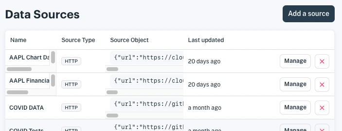
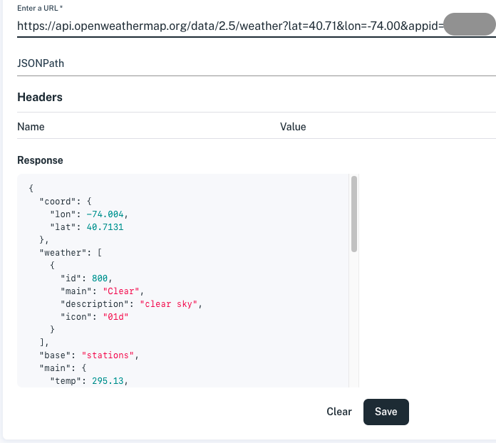
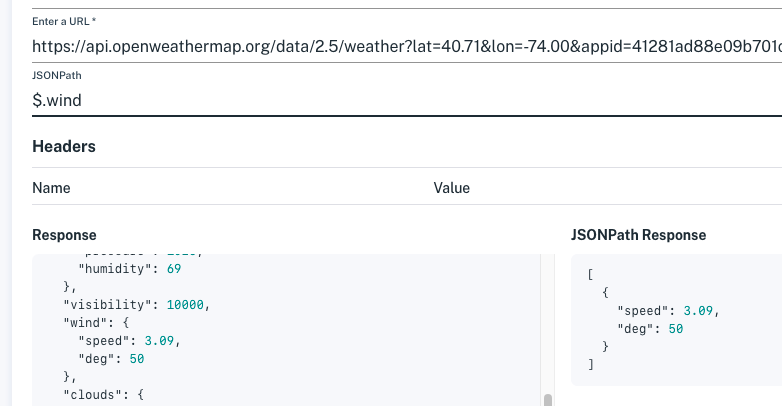

# Accessing Nested JSON Data

If the data you want is nested in JSON response objects, you can specify data location using JSONPath.

``` {important} The JSON data must be passed to Apperate as an array of objects.
```

Here's how to locate the data using the URL data source response preview and JSONPath.

1. Access the Data Sources page, by navigating to **Sources > Data Sources**. The **Data Sources** page appears.
    
    

1. Click **Add a source**. The **Connect a data source** page appears.

1. In the **Connect a data source** page, specify the following items.
    
    **Source Type:** *URL*

    **Data source name:** (unique name)

    **Description:** (optional)

    **Enter a URL:** (the URL)

    **JSONPath:** (see next step)

    **Headers:** (add any required name/value pairs)
    
    If the URL returns a JSON response, the **Response** panel shows a preview of it. The preview of the following URL response shows data elements nested in a JSON object.
    
    

1. If you are using nested JSON elements, use JSONPath to specify the desired object array location in the **JSONPath** field.  
    
    To learn more about JSONPath, see [this article](https://restfulapi.net/json-jsonpath/).
    
    **Supported JSONPath operators:**

    | **Operator(s)** | **Description** |
    | --------------- | ------------------------------------------------------------- |
    | `$` | The root object. **Always** start your JSONPath with dollar sign (*$*). The *$* represents the root element. |
    | `.*name*` | Dot-child references the named sub-element |
    | `[*]` | Returns all array elements. Star (*) is the only supported subscript; index integers are not supported. |

    For example, the path `$.wind[*]` used below specifies the response's *wind* data location. Records at that location show in the **JSONPath Response** panel on the bottom right.
    
     

    >  **Important:** Always test your JSON Path to make sure you're getting the desired JSONPath Response.
    
    Make sure your JSONPath Response is an object array. Its format should look like the following JSON, where object *values* are of any JavaScript type.

    ```javascript
    [
      {
        "name1": value1,
        "name2": value2,
      },
      {
        "name1": value3,
        "name2": value4,
      },
      // ... more objects
    ]
    ```

1. Click **Save**. You return to the Data Sources page and your new data source appears in the list.

Your data source is ready to access data nested in the URL's response JSON objects.

## What's next?

You can create a dataset from your data source data. See [Loading Data from a URL](../migrating-and-importing-data/loading-data-from-a-url.md) for details.