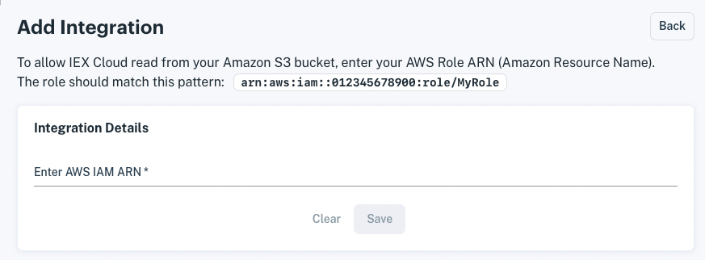
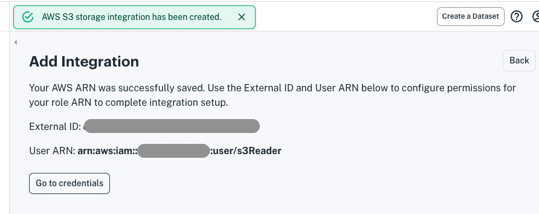
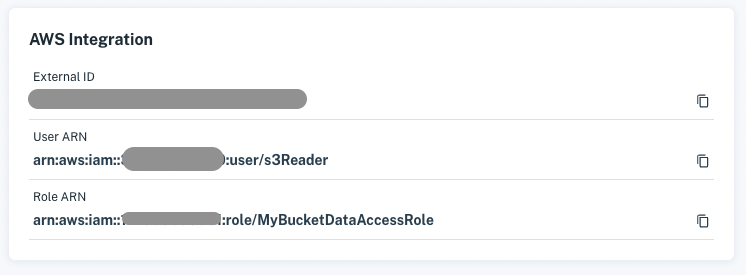

# Accessing AWS S3 via AWS Integration

Apperate's AWS Integration provides a flexible way to connect with your AWS S3 buckets from your workspace. The integration involves granting an AWS user from Apperate access to your bucket via an AWS IAM role and policy.

## Configuring AWS Integration

Here are the steps:

1. In the IAM AWS service, create a policy for accessing your S3 bucket. The policy can be specified using JSON that looks like the following code (replace `BUCKET` and `PREFIX` with your values).

    ```javascript
    s3 policy {
        "Version": "2012-10-17",
        "Statement": [
            {
                "Effect": "Allow",
                "Action": "s3:ListBucket",
                "Resource": "arn:aws:s3:::BUCKET",
                "Condition": {
                    "StringLike": {
                        "s3:prefix": "*"
                    }
                }
            },
            {
                "Effect": "Allow",
                "Action": [
                    "s3:GetObject",
                    "s3:GetObjectVersion"
                ],
                "Resource": "arn:aws:s3:::BUCKET/*"
            },
            {
                "Effect": "Allow",
                "Action": "s3:GetBucketLocation",
                "Resource": "arn:aws:s3:::BUCKET"
            },
            {
                "Effect": "Allow",
                "Action": "s3:ListBucket",
                "Resource": "arn:aws:s3:::BUCKET"
            }
        ]
    }
    ```

1. In AWS, create an IAM Role that uses the above policy. Specify this information:

    - **Entrusted entity type:** AWS account
    - **Account:** this account
    - **Require an external ID:** yes (arbitrary value)
    - **Add permission policy:** select the policy you created
    - **Role name:** (arbitrary value)

    ``` {important} Copy the role's ARN (Amazon Resource Name). For additional information on working with roles, see the AWS documentation [here](https://docs.aws.amazon.com/IAM/latest/UserGuide/id_roles_create_for-user.html).
    ```

1. In IEX Cloud console, start creating an AWS integration by navigating to **Sources &rarr; Credentials**. The Credentials page appears.

1. Click **Create AWS Integration**. The **Add Integration** dialog appears.

    

1. Enter your IAM Role ARN (you copied it earlier) and submit. An External ID and User ARN appear in the Add Integration dialog.

    

1. Click **Go to credentials**. The AWS Integration section at the bottom of your **Credentials** page shows the new External ID and new User ARN. Keep this page open for copying the External ID and User ARN into your IAM role in the AWS console. 

    

1. In the AWS console, edit your IAM role. Copy the **External ID** and **User ARN** values from the IEX console Credentials page (see previous step) and use them to replace the IAM role's principal AWS user account and the external ID in the AWS console.

    The JSON for your role may look like the following code, except `USER` and `EXTERNAL_ID` should be replaced with the values from your AWS integration.

    ```javascript
    {
      "Version": "2012-10-17",
      "Statement": [
        {
          "Effect": "Allow",
          "Principal": {
            "AWS": "USER"
          },
          "Action": "sts:AssumeRole",
          "Condition": {
            "StringEquals": {
              "sts:ExternalId": "EXTERNAL_ID"
            }
          }
        }
      ]
    }
    ```

Your AWS S3 bucket is now integrated with your IEX Cloud workspace. When you parse data or ingest data from an AWS S3 bucket data source, Apperate uses your AWS integration by default, unless you select a [credential instance](./accessing-s3-via-your-access-key.md) to use.

``` {note} You can optionally integrate additional buckets with your workspace using your AWS IAM policy.
```

``` {note} An Apperate workspace has up to one AWS integration External ID and User ARN. If  you want to remove the integration, click **Remove AWS integration** in the Credential page's **AWS Integration** section. You can create a new integration by clicking **Create AWS integration** at the top of the page and entering your IAM Role ARN.
```

## What's Next?

Now that you've configured AWS Integration for your bucket, you can [load your bucket data into Apperate](./loading-data-from-aws-s3.md) for delivering to your apps.

If you're interested in adding your AWS credentials to your IEX Cloud workspace instead of using Apperate's AWS Integration, see [Accessing S3 via Your Access Key](./accessing-s3-via-your-access-key.md).