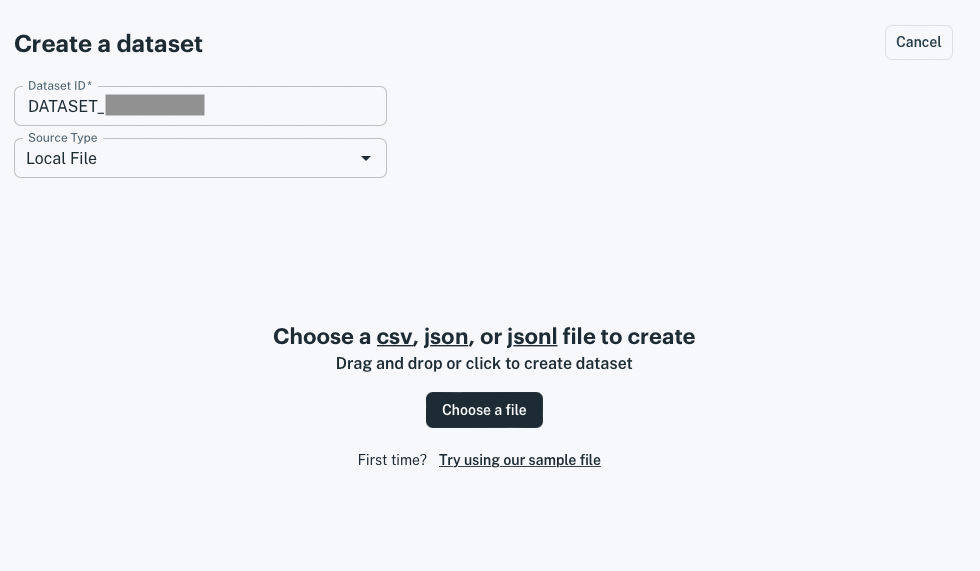
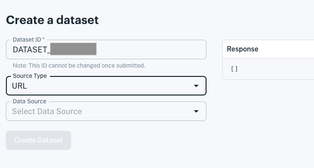
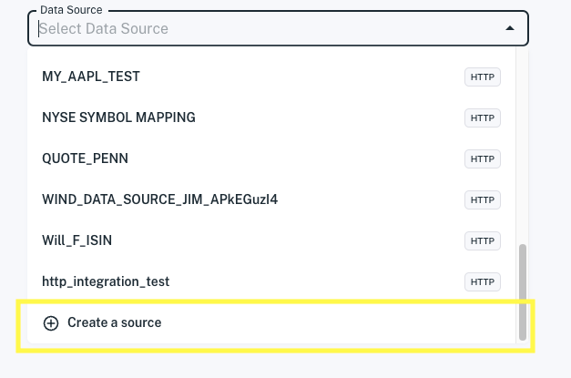
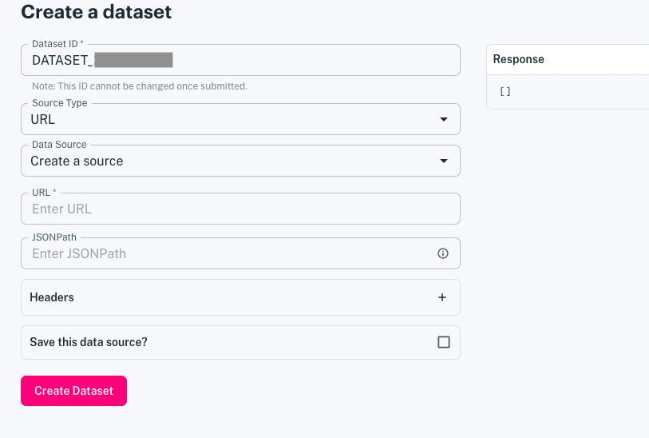

# Loading Data from a URL

If there's a URL that you would like to load data from, you can connect to it and store its data in a dataset for publishing to your apps. Here you will do just that.

## Creating a Dataset with Data from a URL

1. Click **Create a Dataset** at the top of the console or from the **Datasets** page. The **Create a dataset** page appears.

    

1. For **Source Type**, choose **URL**. The **Data Source** selector appears.

    

    You can create a dataset from a new or existing data source. We'll create a new data source.

1. For **Data Source**, choose **Create a source** at the bottom of the list.

    

    The URL fields appear.

    

1. Specify the URL that provides the data you want. The response data appears in the **Response** panel.

    

1. If your URL requires any headers, add them under **Headers** as name/value pairs.

    

1. If the URL response is in JSON, check your data's location in the **Response** panel.

    - If the data you want is in the top level records (as shown in the image below), leave the **JSONPath** field blank.
    - If the data you want is nested deeper within the JSON object, specify the path to it in the **JSONPath** field. Refer to [Accessing Nested JSON Data](./accessing-nested-json-data.md) for more information on specifying JSONPath values.

    ``` {important} For JSON data, Apperate requires an array of objects.
    ```

    The URL below, for example, is good because it returns a JSON object array with all data in the top level objects.

    

1. If you want to save the data source for future data ingestion, select the **Save this data source?** option.

    ``` {note} After creating the dataset, the data source will be saved with an auto-generated name. To find the data source, navigate to **Sources** and sort the list by **Last Updated**. The data source should be one most recently updated.
    ```

1. When you're done specifying the data, click **Create Dataset**. Apperate creates the dataset, loads the data into it, and shows the dataset's **Overview** page.

    

    ``` {tip} If data ingestion fails or you suspect issues, check the ingestion details in the overview's **Data Jobs**  page or navigate to **Logs**, and check  the **Log Stream** or **Ingestion Logs**. For guidance, see [Monitoring Deployments](../administration/monitoring-deployments.md).
    ```

1. In the **Overview** page, fetch the last record by clicking on the **Example Request** URL. A browser tab opens to the URL and Apperate returns the record in a JSON object array. Here's an example array:

    ```json
    [{"change":-0.75,"changeOverTime":47.831683168316836,"changePercent":-0.005,"close":147.96,"date":"2022-06-08","fClose":147.96,"fHigh":149.8697,"fLow":147.46,"fOpen":148.58,"fVolume":53950201,"high":149.8697,"id":"HISTORICAL_PRICES","key":"AAPL","label":"Jun 8, 22","low":147.46,"marketChangeOverTime":47.831683168316836,"open":148.58,"subkey":"","symbol":"AAPL","uClose":147.96,"uHigh":149.8697,"uLow":147.46,"uOpen":148.58,"updated":1654736422000,"uVolume":53950201,"volume":53950201}]
    ```

Congratulations! You loaded data from a URL into a dataset and it is ready to deliver that data to apps.

## What's Next

Here are some things to explore doing with your new data and data source.

- Schedule data ingestion on your new data source. Learn how at [Scheduling Data Ingestion](./scheduling-data-ingestion.md).

- Provide custom views to the data by joining your dataset with a Core Dataset or one of your other datasets. See [Creating and Managing Views](../managing-your-data/creating-and-managing-views.md) for details.

- Use the data in your apps via your dataset API endpoints. Query for the exact data you want as demonstrated in [Apperate Query Basics](../interacting-with-your-data/apperate-api-basics.md).