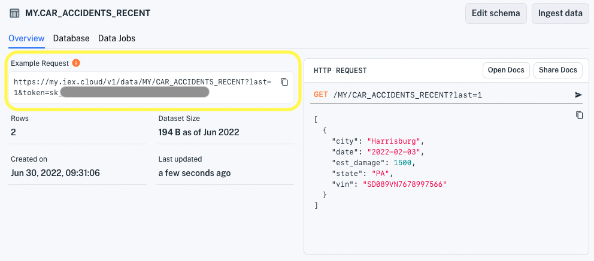

# Loading Data from AWS S3

In few steps, you can import data from CSV, JSON, or JSONL data files in your S3 buckets. Before creating a dataset that uses bucket files, you must configure credentials for accessing the bucket. Here are the credential types:

- **AWS Integration:** Grant Apperate's S3 user bucket read access. Learn how at [Accessing S3 via AWS Integration](./accessing-s3-via-storage-integration.md).
- **Access Key:** Specify your bucket access key and secret access key. For details, see [Accessing S3 via Your Access Key](./accessing-s3-via-your-access-key.md).

Here we'll create a dataset from an S3 bucket file.

## Creating a Dataset with Data from an S3 Bucket

1. Click **Create a Dataset** at the top of the console or from the **Datasets** page. The **Create a Dataset** page appears.

    

1. In the **Use a new data source** section, choose **AWS S3** in the source type. The AWS S3 bucket fields appear.

    

1. Select your credential for accessing the bucket.

    

    - If you want to use AWS Integration, you can select **AWS Ingtegration** to use your configuration or to configure it if you haven't configured it already. 
    - If you want to use an access key credential, you can select an existing access key credential or create one.

1. Enter your AWS bucket name. All of your bucket files (file keys) appear in the Bucket Contents list.

    

1. Specify a file(s) to load data from by selecting a file key or entering a file pattern.      

    - **Select a file key** - Select a file from the Bucket Contents list. The *Response* panel updates to reflect the selected file's content.

        

        > **Tip:** You can filter on files in a particular folder by entering a folder name in the *file prefix* field at the top-right of Bucket Contents.

    - **Enter a File pattern** - Enter a file pattern (filename glob) using `*`, `?`, and `[]` to match the file(s) you want to ingest. Inside brackets `[]`, you can put "or" options to match individual characters or a character range (e.g., `foo[2-4]` matches `foo2` and `foo3` but not `foo5`). The Response panel updates to show contents of a matching file that has the oldest modified timestamp in the bucket.

        An array of JSON objects based on a sample of the oldest matching file's data appears in the **Response** panel. Apperate uses this sample to build the dataset schema.

         

    > **Important:** To load JSON data, the data must be an array of objects.

    If you specified a JSON file(s) and the Response panel shows the object array you want, leave the JSONNPath field empty. Otherwise, use the JSONPath field to specify the path to a desired object array in the JSON file. A **JSON Response** panel on the bottom right shows the data found at the JSONPath.

    > **See also** [Accessing Nested JSON Data](./accessing-nested-json-data.md) for guidance on specifying JSONPath for JSON file data.

    When you're done specifying the data, click **Parse Data**. The schema editor appears.

    

1. In the schema editor, name your dataset, check the property types and indexes, and specify whether to opt in an indexed property to the metadata graph. 

    > **Note:** the metadata graph opt-in, provides the opportunity to map a property to IEX Cloud's metadata data graph of [financial identifiers](../reference/financial-identifiers.md). This allows you to enrich your dataset by joining it to IEX Cloud core equities data or any other dataset that is also opted in. Furthermore, you can ingest data into and query for data in this dataset using IEX Cloud's supported financial identifiers. See [Normalization](../managing-your-data/defining-schemas/normalization.md) for examples.

    When you're happy with the schema, click **Create dataset now**.

    Apperate creates the dataset, loads the file's data into the dataset, and shows the dataset's **Overview** page.

    

    > **Note:** If data ingestion fails or you suspect issues, check the ingestion details in the overview's **Data Jobs**  page or navigate to **Logs**, and check  the **Log Stream** or **Ingestion Logs**. For guidance, see [Monitoring Deployments](../administration/monitoring-deployments.md).

1. In the **Overview** page, fetch the last record by clicking on the **Example Request** URL. A browser tab opens to the URL and Apperate returns the record in a JSON object array. Here's an example array:

    ```json
    [{"city":"Harrisburg","date":"2022-02-03","est_damage":1500,"state":"PA","vin":"SD089VN7678997566"}]
    ```

Congratulations! You loaded data from your AWS S3 bucket into a dataset and that's ready to deliver that data to your apps.

## What's Next

Here are some things to explore doing with your new data and data source.

- Schedule data ingestion on your new data source. Learn how at [Scheduling Data Ingestion](./scheduling-data-ingestion.md).

- Provide custom views to the data by joining your dataset with a Core Dataset or one of your other datasets. See [Creating and Managing Views](../managing-your-data/creating-and-managing-views.md) for details.

- Use the data in your apps via your dataset API endpoints. Query for the exact data you want as demonstrated in [Apperate Query Basics](../interacting-with-your-data/apperate-api-basics.md).

---
[Go to Docs Home](https://github.com/iexcloud/docs/blob/main/README.md)