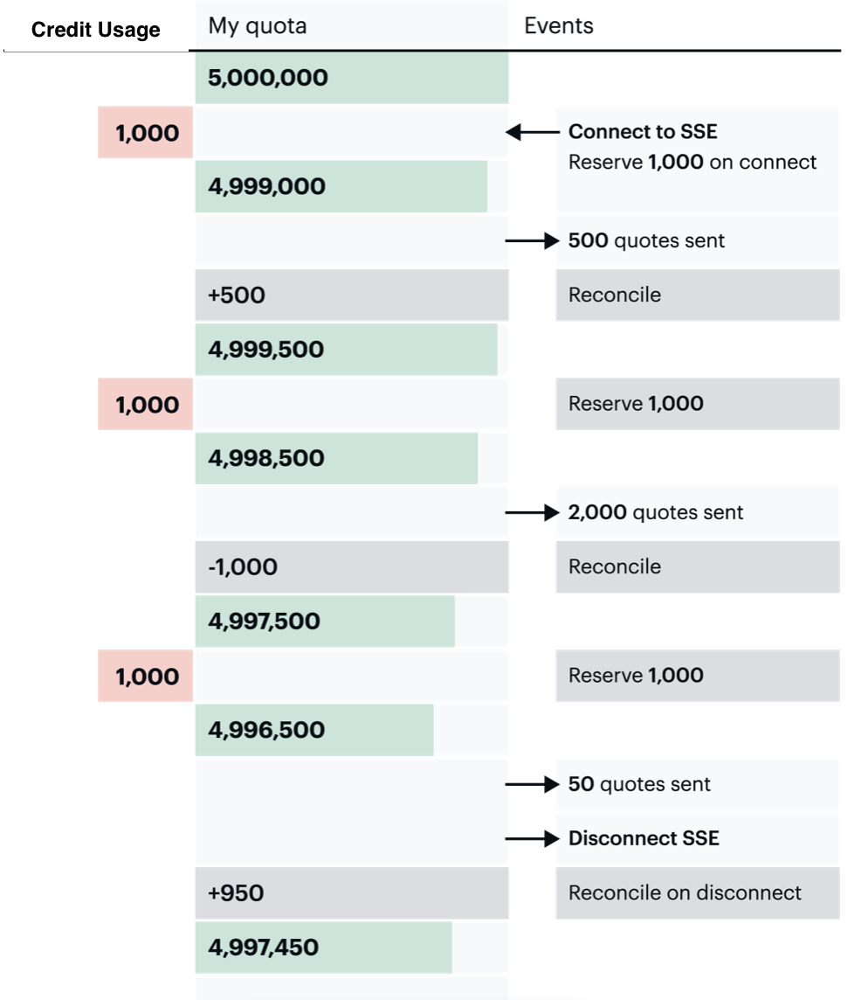

# Streaming Data Using SSE

We support Server-sent Events ([SSE Streaming](https://en.wikipedia.org/wiki/Server-sent_events)) for streaming data as an alternative to WebSockets. You will need to decide whether SSE streaming is more efficient for your workflow than REST calls. In many cases, streaming is more efficient since you will only receive the latest available data. If you need to control how often you receive updates, then you may use REST to set a timed interval.

When you connect to an SSE endpoint, you should receive a snapshot of the latest message, then updates as they are available.

cURL Example:

```bash
curl --header 'Accept: text/event-stream' https://cloud-sse.iexapis.com/v1/stocksUS\?symbols\=spy\&token\=YOUR_TOKEN
```

cURL Firehose Example (Available with Business plans and legacy Scale plans):

```bash
curl --header 'Accept: text/event-stream' https://cloud-sse.iexapis.com/v1/stocksUS\?token\=YOUR_TOKEN
```

## Pricing: How credits are counted

We use a special "reserve system" for streaming endpoints due to high data rates. This is similar to how a credit card puts a hold on an account and reconciles the amount at a later time.

When you connect to an SSE endpoint, we will validate your API token, then attempt to reserve an amount of credits (previously known as messages) from your account. If you have enough credits in your quota, or if you're on a legacy Launch, Grow, or Scale plan and you have pay-as-you-go credits enabled, we will allow data to start streaming.

We keep track of the number of credits streamed to your account during our reserve interval.

Once our reserve interval expires, we will reconcile usage. This means we will compare how many credits were sent versus the number of credits we reserved. For example, if you used 1,200 credits, you would have used 200 more than we reserved, so we will use 200 additional credits on your account. If we only used 100 credits, we would return the 900 unused credits back to your account.

After we reconcile the credits, we will attempt another reserve.

The reserve and reconcile process is seamless and does not impact your data stream. If we attempt to reserve credits and your account does not have enough quota and pay-as-you-go disabled, then we will disconnect your connection. You can avoid service disruptions by ensuring you have enough packages purchased in advance, and for legacy plans, enabling pay-as-you-go credits in the Console.

When you disconnect from an endpoint, we will reconcile your credit usage immediately.



## Firehose

Business and Legacy Scale plan users can firehose stream all symbols (excluding DEEP endpoints) by leaving off the symbols parameter.

## Interval Streaming

Some SSE endpoints are offered on set intervals such as one second, five seconds, or one minute. This means we will send data no more than the interval subscribed to. This helps make data delivery and credit usage more predictable.
